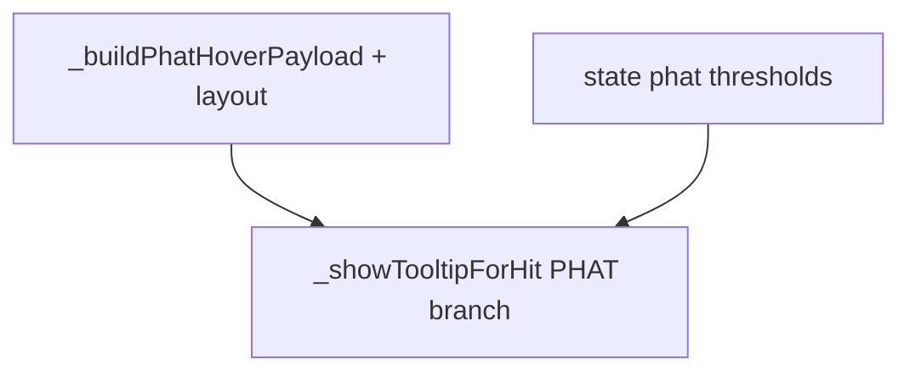

# PHAT candle tooltip improvements (from notes.txt)

## Current state

- Tooltip DOM is built in [`src/ui/tooltip.js`](src/ui/tooltip.js) (`_showTooltipForHit`, `hit.kind === 'phatCandle'`). Structure today: single **head** (`tt-head`), one **metrics** line (`tt-desc` + imbalance/rejection), optional **detail** line, **hint** footer (“PHAT read is descriptive…”).
- Copy templates `_phatTemplate` / `_phatRejectionLabel` use coarse strings; **“moderate”** maps to [`_classifyPhatRejection`](src/render/priceChart.js) `strengthLabel` only (not liquidity).
- Payload comes from [`_buildPhatHoverPayload(bar, isUp)`](src/render/priceChart.js) (`shape`, `imbalance`, `rejection` with `rejectionSide`, `sideLiquidity`, etc.). **Delta**, **viewport volume tier**, **narrow/wide body**, **disagreement vs below-gate neutral**, and **ring fill/open** are **not** fully surfaced.

## Copy conventions (locked — addresses relativity, thresholds, delta wording)

### Viewport-relative volume / body width (honest labeling)

PHAT body width uses **`volumeNorm01Linear`** over **visible** bars ([`viewportVolumeNorm.js`](src/analytics/viewportVolumeNorm.js) / chart draw path). **The same bar can read as a different band after pan/zoom** — that is correct behavior, not a bug.

- **Never** imply absolute contract volume (“high volume”) without context.
- **Always** qualify band copy, e.g.:
  - **Body tier:** `Narrow body (≤1 tick)` vs `Wide body (>1 tick)` — structural; unchanged by viewport.
  - **Relative width:** phrases like `Relative volume in this view: lower third` / `middle third` / `upper third` — never bare “high volume.”
  - Optional one-line reminder (measurements section footer): `Bands use visible bars only — pan/zoom rescales them.` (Short; once per tooltip max.)

### Imbalance qualitative bands (explicit numeric rules)

Let **G** = **`state.phatBodyImbalanceThreshold`** (default **0.30**). Labels apply to displayed imbalance **I**:

| Label | Condition |
|--------|-----------|
| **Below gate** | **I < G** |
| **Near gate** | **G ≤ I < 0.50** (only if **G < 0.50**; otherwise skip this tier) |
| **Strong** | **I ≥ 0.50** |

Display always echoes **G** numerically in the imbalance line, e.g. `Imbalance: 0.42 (gate 0.30 · near gate)`. If **G ≥ 0.50**, collapse to **below gate** vs **at or above gate** (no “near” slice).

### Delta + matrix cross-reference (single canonical string)

Use **one** line template everywhere (no optional vague micro-copy):

**`Delta: {signed integer} · matrix point {green | red | neutral gray}`**

Examples: `Delta: -245 · matrix point red`, `Delta: 120 · matrix point green`, `Delta: 0 · matrix point neutral gray`. Matrix hue follows [**§6.1 delta-colored dots**](requirements.md) (sign + magnitude); “neutral gray” covers zero / missing delta parity.

### Rejection: qualitative strength only (no pixel diameter)

- Show **`weak` / `moderate` / `strong`** from existing **`strengthLabel`** logic in [`_classifyPhatRejection`](src/render/priceChart.js).
- **Do not** mention ring radius in px — diameter is the **visual** encoding; tooltip stays textual.

### Which wick gets the circle (pipeline transparency)

Single marker per bar comes from [`pipeline/src/orderflow_pipeline/phat.py`](pipeline/src/orderflow_pipeline/phat.py): **`high_score`** vs **`low_score`** (retreat × dwell near each extreme). **Higher score wins** `high` vs `low`; if equal or neither qualifies, **`rejection_side`** stays **`none`**.

Tooltip behavior:

- Always state **high** vs **low** when `hasRejection`.
- When **both** `upperWickLiquidity` and `lowerWickLiquidity` are above a small epsilon (both extremes materially scored in UI terms), append one clause: **`Marker uses the side with the higher pipeline rejection score (vs the other extreme).`**
- Do **not** invent numeric score breakdown unless we later add **`rejection_high_score` / `rejection_low_score`** to bar JSON (optional Phase 2 — out of scope unless requested).

## Target UX (layered narrative)

1. **Header:** pattern + structural hints (half/side, narrow vs wide body).
2. **Measurements:** viewport-honest relative volume band; imbalance with **G** + band row above; rejection side/type/liquidity vs exhaustion threshold; **no** px ring note.
3. **Interpretation:** one plain-language sentence (`line3` variants).
4. **Disagreement banner** when Option A neutral + imbalance ≥ gate.
5. **Delta line:** canonical string above.
6. **Footer:** descriptive-not-predictive disclaimer unchanged.

## Implementation plan

### 1. Enrich payload in [`src/render/priceChart.js`](src/render/priceChart.js)

- Extend **`_buildPhatHoverPayload(bar, isUp, layout?)`**:
  - **`layout`:** `{ volNorm, narrowBody }` from the candle draw loop (`volumeNorm01Linear`, `bodyTicks <= 1`).
  - **`neutralReason`:** `'below_gate' | 'disagreement' | 'no_norms' | null` per **`_classifyPhatBody`**.
  - **`disagreementFlag`:** neutral + imbalance ≥ G + hasNorms.
  - **`delta`:** finite numeric when present.
  - **`rejectionRingFilled`:** mirror **`_drawPhatCandle`** **`_ringFilled()`** (absorption filled; exhaustion filled iff side liquidity ≥ **`state.phatExhaustionRingLiquidityThreshold`**).
  - **`bothWicksLiquidity`** (boolean): `upperWickLiquidity > ε && lowerWickLiquidity > ε` for the explanatory clause (ε ≈ **0.02** or smallest meaningful float — tune in code).
  - **Remove** prior plan item **`rejectionRingRadiusApprox`** / any px diameter field from payload.
- Pass **`layout`** from **`chartHits.push`** (~1160).

### 2. Refactor PHAT tooltip in [`src/ui/tooltip.js`](src/ui/tooltip.js)

- Structured HTML: **`tt-phat-measure`**, **`tt-phat-warn`**, delta line using **exact** template **`Delta: … · matrix point …`**.
- Implement imbalance band helper using **G** and the **Below / Near / Strong** table above.
- Volume band: **thirds** of **`volNorm`** ∈ [0,1] with **“in current view”** / **visible bars** wording + optional short relativity reminder.
- Rejection block: side, type, liquidity vs threshold, strength label **only**; optional **`bothWicksLiquidity`** sentence per pipeline transparency section.

### 3. CSS [`styles/dashboard.css`](styles/dashboard.css)

- Spacing for new classes (unchanged intent).

### 4. [`requirements.md`](requirements.md)

- §7.1: viewport-honest tooltip bands; imbalance bands vs **G**; delta line template; rejection side selection references pipeline winner rule; no pixel ring copy.

## Testing (manual)

- Same as before: P/b/neutral/disagreement/rejection variants; **pan chart** and confirm volume-band text changes but stays honestly labeled; delta line matches matrix dot color.

## Files touched (expected)

| File | Role |
|------|------|
| [`src/render/priceChart.js`](src/render/priceChart.js) | Payload + layout |
| [`src/ui/tooltip.js`](src/ui/tooltip.js) | PHAT HTML + locked copy |
| [`styles/dashboard.css`](styles/dashboard.css) | Tooltip spacing |
| [`requirements.md`](requirements.md) | Behavior |

Implementation follows **`notes.txt`** plus the locked conventions in this document.
