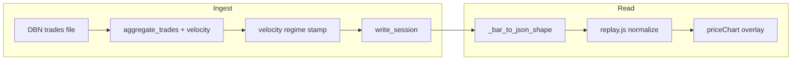

# Velocity metrics: DB schema, ingest, and chart representation

## Context: spec vs current stack

Original long-form spec imagined **four-layer DuckDB** (`trades_raw` → `trades_1s` → bars). This project already ingests **Databento trades in Python** via [`decode.py`](pipeline/src/orderflow_pipeline/decode.py) into [`aggregate_trades`](pipeline/src/orderflow_pipeline/aggregate.py) and persists **`bars`** with **`PRIMARY KEY (bar_time, timeframe)`** and **session-anchored RTH binning**.

**Resolved decisions (from project `notes.txt`):**

| Topic | Resolution |
|-------|------------|
| 1s intermediate layer | **Skip for v1.** No in-memory 1s buckets unless a future audit/SQL path needs them. Single pass: maintain lag state and accumulate **directly into per-bar structs** keyed by the same `bin_ns_start` as OHLC. |
| Regime trailing window | **Do not mix globex and RTH** in the 200-bar history. Restrict percentiles to bars of the **same session type** as the current bar (e.g. current RTH segment only, or current globex segment only). |
| Session-open path | **No cross-session lag for path:** first trade of a session starts path accumulation—no phantom \(|\Delta|\) from the prior session’s last price. **Document** in `requirements.md`. |
| Path vs flip asymmetry | **Path length:** consecutive-trade continuity **across bar boundaries** within a session (segment from prior bar’s last trade into this bar counts toward the bar that owns the later trade). **Flip count / flip_rate:** **within-bar only**—do **not** count the transition from prior bar’s last trade to this bar’s first trade. Denominator **`trade_count - 1`** for bars with ≥ 2 trades; **NULL** `flip_rate` when `trade_count <= 1`. |
| Aggressor volumes | **One naming scheme only**—do **not** ship parallel `bid_volume`/`ask_volume` **and** existing `sum_aggressive_*` / `avg_aggressive_*`. **v1:** reuse existing persisted aggressor columns where they already capture the same semantics; add new columns only for genuinely new scalars (`path_length_ticks`, `vw_path_length`, etc.). |
| `vw_path_length` | **Include from v1**—cheap in the same loop as path length (`|\Delta \text{ticks}| * size` per contributing segment). |

## 1. Schema: new columns on `bars`

Add upgrade-safe columns via the existing `ALTER TABLE bars ADD COLUMN IF NOT EXISTS` pattern in [`db.py`](pipeline/src/orderflow_pipeline/db.py).

**New columns (additive):**

| Purpose | Columns |
|---------|---------|
| Geometry | `path_length_ticks` BIGINT, `vw_path_length` DOUBLE, `displacement_ticks` INTEGER, `abs_displacement_ticks` INTEGER, `pld_ratio` DOUBLE |
| Conviction | `flip_count` INTEGER (within-bar only), `flip_rate` DOUBLE |
| Regimes | `jitter_regime` VARCHAR, `conviction_regime` VARCHAR |

**Do not add** duplicate bid/ask volume columns if [`Bar`](pipeline/src/orderflow_pipeline/aggregate.py) / `bars` already holds the same numbers under `aggressive_*` / `sum_aggressive_*` / `avg_aggressive_*` after verifying Databento `A`/`B` semantics.

- `pld_ratio` = `path_length_ticks / GREATEST(abs_displacement_ticks, 1)` with a documented **upper cap** (e.g. 100).

Extend [`write_session`](pipeline/src/orderflow_pipeline/db.py) and `bars_df` expectations accordingly.

## 2. Ingest model: single-pass into bars (no 1s layer)

**Invariant:** Same `bin_ns_start` assignment as today for every trade ([`aggregate_trades`](pipeline/src/orderflow_pipeline/aggregate.py)).

**Algorithm (v1):**

1. Sort / iterate trades in **`ts_event`** order (existing loop order).

2. Maintain **`lag_price_ticks`** and **`lag_effective_side`** (last non-`N` side) **only within the current session** for path and within-bar flip logic:
   - **On first trade after session open:** set lag from that trade’s price only—**no** contribution from previous calendar session.
   - For each subsequent trade: compute \(|\Delta\text{ticks}|\) vs lag for **path_length_ticks** and **vw_path_length** (multiply segment by appropriate size—define whether VW uses aggressor size only or total trade size in `requirements.md`).

3. **Assign each trade to a bar** using existing OHLC bin rules; add the **path segment** (and VW segment) to **that bar’s** accumulators.

4. **Within-bar flips only:** when updating the bar that owns the trade, compare current effective side to the **previous trade’s effective side that belonged to the same bar** (or “no prior side in bar”) for flip_count. **Ignore** the flip across the bar boundary for flip_count (first trade of bar does not create a flip vs previous bar’s last side).

5. After the pass: `displacement_ticks` / `abs_displacement_ticks` from bar open/close in tick space; `flip_rate` = `flip_count / GREATEST(trade_count - 1, 1)` or **NULL** if `trade_count <= 1`.

**Deferred:** DuckDB `trades_raw` / `trades_1s` persistence—only if you later need audit or SQL-only recomputation.

## 3. Regime classification

Module (e.g. `velocity_regime.py`) + CLI hook **after** velocity scalars, **before** `write_session`:

- **200-bar** causal trailing window, **terciles**, conviction label inversion vs flip (low flip ⇒ high conviction)—as in the original spec **except**:
- **Window composition:** only bars from the **same session class** as the current row (e.g. RTH-only history when classifying an RTH bar; globex-only when classifying globex). Implement by tagging bars with session segment / type during ingest or deriving from `bar_time` + session calendar rules consistent with the pipeline’s `session` flag.

- **NULL** warmup when insufficient **same-type** history.

## 4. API and frontend

- [`api/main.py`](api/main.py): camelCase for new fields (`pldRatio`, `flipRate`, `vwPathLength`, `jitterRegime`, `convictionRegime`, …).

- [`replay.js`](src/data/replay.js): spread preserves unknown keys; optional explicit defaults.

- [`priceChart.js`](src/render/priceChart.js) + [`state.js`](src/state.js): overlay toggles for tint/marker when data present.

## 5. Testing and documentation

- Unit tests: session-open reset (no cross-session path); path segment across **bar** boundary lands on correct bar; flip_count excludes boundary flip; `flip_rate` NULL for ≤1 trade; `pld_ratio` cap.

- [`requirements.md`](requirements.md): document asymmetry, regime window session restriction, column list, and volume-column policy (single source of truth).

## 6. Clarification note (path across bars vs session open)

After session open reset, the **first** bar of the session has no incoming path segment from outside the session. **Between bars inside the same session**, path segments that cross a bar boundary **do** contribute to path_length for the bar that contains the **later** trade(s), matching geometric continuity without counting cross-bar flips in `flip_count`.
